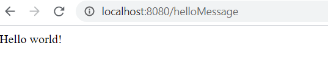
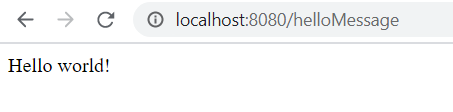

# Exercise 1 - Crafting an API 

We are going to create a project using Spring . Take a moment to think about how you have created projects in the past....

* Created from a random template on the internet?
* Copy and pasted from StackOverflow until something worked?
* Found a project within an organisation and used the same thing (just renaming a few things)

Our workshop starts with a empty folder. We are going to use our starter project [Undertow Spring Starter](<https://github.com/essentialprogramming/undertow-spring-starter>) to create our project and get started.

If you have not completed the [pre-requisites](../prerequisites/README.md) please complete these steps first.

## Step 1 - Creating our First Spring Controller

In the project we will create a small controller.

Usually controllers would live in their own package, you should create the `SpringController.java` in your project.

```java
import com.service.HelloService;
import org.springframework.beans.factory.annotation.Autowired;
import org.springframework.http.HttpStatus;
import org.springframework.http.ResponseEntity;
import org.springframework.stereotype.Controller;
import org.springframework.web.bind.annotation.*;


@Controller
public class SpringController {

    @Autowired
    private HelloService service;

    @RequestMapping(value = "/helloMessage")
    public ResponseEntity<String> sayHello() {
        String message = service.sayHello();
        return new ResponseEntity<>(message, HttpStatus.OK);
    }

}
```

We can now start our project by running `Server.java` (or the class which contains the main method).
In a couple of seconds you should be able to visit [http://localhost:8080/helloMessage](http://localhost:8080/helloMessage)



## Step 2 - Creating Spring Reactive Controller

We will create a REST controller, `TestController.java` that contain one endpoint which return a CompletableFuture.
```java
@RestController
@RequestMapping("/")
public class SpringController {

        @GetMapping("helloMessage")
           @Async
           public CompletableFuture<String> sayHello() {
       
               ExecutorService executorService = executorsProvider.getExecutorService();
               CompletableFuture<String> asyncResponse = Computation.computeAsync(() -> "Hello world!", executorService);
       
               return asyncResponse;
       
           }
}
```
Now we can run our application using bootRun from Gradle Tool window.

Hit [http://localhost:8080/helloMessage](http://localhost:8080/helloMessage) to see the message.



## Step 3 - Creating JAX-RS Controller

JAX-RS is nothing more than a specification, a set of interfaces and annotations offered by Java EE. 

We defined the entry path as being /api. Whatever other paths we declare for our resources, they will be prefixed with /api.

We have a simple endpoint which takes a path parameter for the message we want to show. The controller class looks like this:

We can start the application by running `Server.java`.
```java
@RequestScoped
@Path("/")
public class JaxRSController {
   
      @GET
      @Path("helloMessage")
      public Response sayHello() {
  
          String output = "Hello world!";
  
          return Response.ok(output).status(200).build();
  
      }
    
}
```

Now visit [http://localhost:8080/helloMessage](http://localhost:8080/api/helloMessage) .


## Step 4 - Creating JAX-RS Reactive Controller

The controller we are going to create is `GraphQLController.java`.

We have two endpoints and one of them contain an AsyncResponse parameter.

AsyncResponse is an injectable JAX-RS asynchronous response that provides means for asynchronous server side response processing.

A new instance of AsyncResponse may be injected into a resource or sub-resource method parameter using the @Suspended annotation.

Each asynchronous response instance is bound to the running request and can be used to asynchronously provide the request processing result.

We created a custom Computation class that contain wrapper methods for CompletableFuture.
```java
import java.util.concurrent.Callable;
import java.util.concurrent.CompletableFuture;
import java.util.concurrent.CompletionException;
import java.util.concurrent.ExecutorService;
import java.util.logging.Level;
import java.util.logging.Logger;

public final class Computation {

	private static final Logger LOGGER = Logger.getLogger(Computation.class.getName());

	private Computation() {
	}

	/**
	 * Wrapper method to return a CompletableFuture that calls the given callable asynchronously. Wraps and handles the 
	 * callable's exceptions by explicitly completing the CompletableFuture exceptionally.
	 * @param callable
	 * @param <R>
	 * @return
	 */
	public static <R> CompletableFuture<R> computeAsync(Callable<R> callable,
			ExecutorService executorService) {
		return CompletableFuture.supplyAsync(() -> {
			try {
				return callable.call();
			} catch (Exception ex) {
				LOGGER.log(Level.SEVERE, ex.getMessage(), ex);
				throw new CompletionException(ex);
			}
		}, executorService);
	}

	/**
	 * Wrapper method over void tasks that ought to be run asynchronously. Handles logging of checked exceptions.
	 * @param callable
	 * @param executorService
	 */
	public static CompletableFuture<Void> runAsync(Runnable callable, ExecutorService executorService) {
		return CompletableFuture.runAsync(() -> {
			try {
				callable.run();
			} catch (Exception ex) {
				LOGGER.log(Level.SEVERE, ex.getMessage(), ex);
				throw new CompletionException(ex);
			}
		}, executorService);
	}

}

```

```java
@RequestScoped
@Path("/")
public class JaxRSController {
    
    @GET
    @Path("helloMessage")
    public void sayHello(@Suspended AsyncResponse asyncResponse) {

        ExecutorService executorService = executorsProvider.getExecutorService();

        Computation.computeAsync(() -> executeHelloMessage("Hello world!"), executorService)
                .thenApplyAsync(asyncResponse::resume, executorService)
                .exceptionally(error -> asyncResponse.resume(handleException(error)));
    }
}

```
One example without AsyncResponse:

```java
@RequestScoped
@Path("/")
public class JaxRSController {
    
    @GET
    @Path("helloMessage")
    public String sayHello() throws IOException {

        return executeHelloMessage("Hello world!");
    }
}
```


### Step 5 (Optional) - Deploying with Docker

In order to build a docker container we first need to test running the application as a jar locally.
Execute the following command in order to build locally, from the command line :  
* run `mvn clean install` from the command line 

The following jar file should now be created: `target/project-name-1.0.0-SNAPSHOT.jar`  
You can run this jar using `java -jar target/project-name-0.0.1-SNAPSHOT.jar` (*make sure you are on the pom.xml file path*)  
The application will now be running and testable on <http://localhost:8080/hello>.

The following `Dockerfile` can now be created in the root of the project.

```docker
# Start with a base image containing Java runtime
FROM openjdk:8-jdk-alpine


# Add a volume pointing to /tmp
VOLUME /tmp

# Make port 8080 available to the world outside this container
EXPOSE 8080

# The application's jar file
ARG JAR_FILE=target/project-name-1.0.0-SNAPSHOT.jar

# Add the application's jar to the container
ADD ${JAR_FILE} project-name.jar

# Run the jar file
ENTRYPOINT ["java","-Djava.security.egd=file:/dev/./urandom","-jar","/project-name.jar"]
```

The docker image can now be built with the following command:

`docker build -t apiworkshop:v1 .`  
>apiworkshop:v1 represents the desired name for the docker image image 

Once the build is created our image will be visible by running `docker images`.

```shell
$ docker images
REPOSITORY                                                TAG                 IMAGE ID            CREATED             SIZE
apiworkshop                                               v1                  38a02d5fb614        5 minutes ago       622MB
```

We can now run our image using the following docker command

`docker run -p 8080:8080 -t apiworkshop:v1`

Note the -p command sets up the port mapping. <http://localhost:8080/hello> - will now be the docker hosted application.
We can view our running docker containers using the command `docker ps`

```shell
$ docker ps
CONTAINER ID        IMAGE               COMMAND                  CREATED              STATUS              PORTS                    NAMES
46c5781e269f        apiworkshop:v1      "sh -c 'java $JAVA_O…"   About a minute ago   Up About a minute   0.0.0.0:8081->8080/tcp   peaceful_stonebraker
```

If you need to restart/stop the container run `docker kill <container ID>`.

