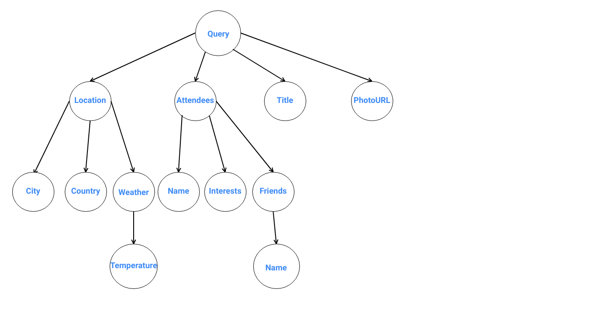

## GraphQL Concepts

- ### <u>Schema</u>
GraphQL schema contains what information is being made available. A client could use this schema and determine how to construct a request, which will fetch/update the relevant data on the server. The most basic components of a GraphQL schema are object types, which just represent a kind of object you can fetch from your service, and what fields it has. In this article, we will begin our implementation by first constructing schema, let us discuss more, when we get there.

- ### <u>Queries and Mutations</u>
There are two different types of GraphQL requests that could be sent from client to server. The first type is “query”, these are used for reading data from the server. By Convention “query” requests should have no side-effects on the server. The second type is “mutation”, these are used to modify the data on the server side. Just like in queries, if the mutation field returns an object type, one could ask for nested fields. This can be useful for fetching the new state of an object after an update.

- ### <u>Arguments</u>
Each GraphQL query/mutation can take arguments. The arguments can be simple built-in scalar types (like String, Int) or complex objects (the fields of which are either other objects or scalar types). When arguments are present server could use these arguments, either to identify a resource or filter the response.

- ### <u>Variables</u>
In a real application the arguments to a request will be dynamic, generated by user actions. It wouldn’t be a good idea to pass these dynamic arguments directly in the query string, because then our client-side code would need to dynamically manipulate the query string at runtime, and serialize it into a GraphQL-specific format. Instead, GraphQL has a first-class way to factor dynamic values out of the query, and pass them as a separate dictionary. These values are called variables. Variables are passed alongside the request, which contains placeholders instead of actual argument values. On the server, all placeholders in the request will be resolved from the variables before executing the request.

- ### <u>Endpoint</u>
Unlike REST, GraphQL server operates on a single URL/endpoint, usually /graphql, and all GraphQL requests for a given service should be directed at this endpoint. Generally, the GraphQL request is sent through an HTTP POST request, where the contents for GraphQL request are placed in the body of the POST request.

- ### <u>Introspection</u>
It’s often useful to ask a GraphQL schema for information about what queries it supports. GraphQL allows us to do so using the introspection system. Through this one can access the documentation about the type system in the schema which could be used for rich IDE experiences. GraphQL Playground is a good example of one of many applications that makes use of introspection to provide better development workflows while using GraphQL.

- ### <u>Resolver</u>
A resolver is a function that resolves a value for a type or field in a schema. Resolvers can return objects or scalars like Strings, Numbers, Booleans, etc. If an Object is returned, execution continues to the next child field. If a scalar is returned (typically at a leaf node), execution completes. If null is returned, execution halts and does not continue.

Resolvers can be asynchronous too! They can resolve values from another REST API, database, cache, constant, etc.

- ### <u>Executing queries</u>
To better understand resolvers, you need to know how queries are executed.
Every GraphQL query goes through three phases. Queries are parsed, validated and executed.
1. **Parse** — A query is parsed into an abstract syntax tree (or AST).
2. **Validate** — The AST is validated against the schema. Checks for correct query syntax and if the fields exist.
3. **Execute** — The runtime walks through the AST, starting from the root of the tree, invokes resolvers, collects up results, and emits JSON.

For this example, we’ll refer to this query:

```graphql
query {
  event(id: "5983706debf3140039d1e8b4") {
    title
    photoURL
    location {
       city
       country
       weather {
          temperature  
       }
    }
    attendees {
        name
        friends(interest: "Java" ){
            name
        }
        interests
    }
  }
}

```

When this query is parsed, it’s converted to an AST, or a tree.

  