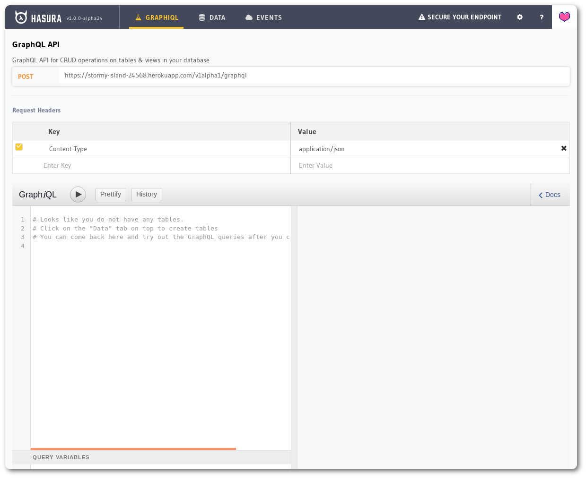
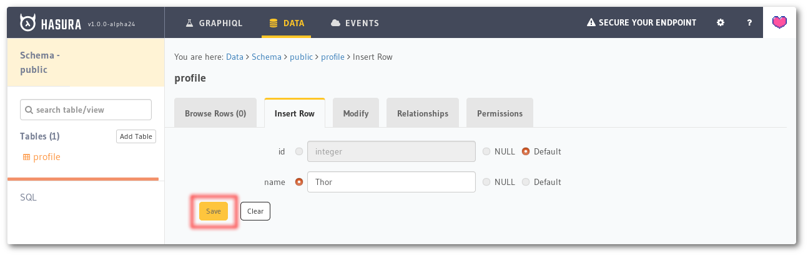
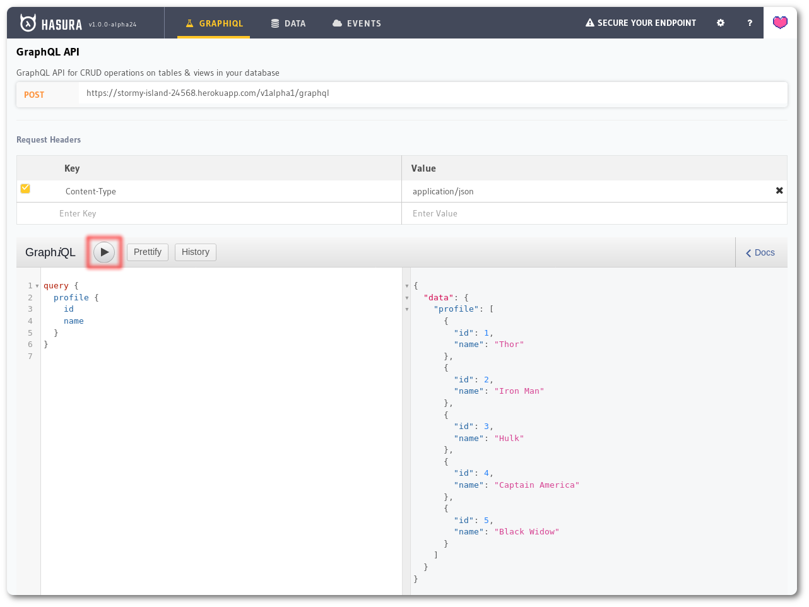

### Deploy Hasura GraphQL in Digital Ocean  
  
 1. Create a Hasura One-click Droplet  
    * Click the button below to create a new Hasura GraphQL engine Droplet through the DigitalOcean Marketplace. For first time users, the link also contains a referral code with gives you $100 over days. A $5 droplet is good enough to support most workloads. (Ctrl+Click to open in a new tab)
    [](https://marketplace.digitalocean.com/apps/hasura?action=deploy&refcode=c4d9092d2c48&utm_source=hasura&utm_campaign=docs)  
 
 2. Once the Hasura GraphQL engine Droplet is ready, you can visit the Droplet IP to open the Hasura console, where you can create tables, explore GraphQL APIs etc.  
    >Note that it might take 1 or 2 minutes for everything to start running.  
    * The Hasura console will be at :  
    ```http://<your_droplet_ip>/console```  
    * The GraphQL endpoint will be :  
    ```http://<your_droplet_ip>/v1/graphql```  
    >A Postgres database is also provisioned on the Droplet. Using the console, you can create a table on this Postgres instance and make your first GraphQL query.
    

 3. Create a Table  
    * Navigate to ```Data -> Create``` table on the console and create a table called profile with the following columns: ```id``` and ```name```  
        
    * Choose id as the Primary key and click the Create button.  
    
 4. Insert sample data  
    * Once the table is created, go to the Insert Row tab and insert some sample rows :   
        ```
        Thor
        Iron Man
        Hulk
        Captain America
        Black Widow 
        ```  
          
          
 5. Try out GraphQL  
    ```
    query {
         profile {
           id
           name
         }
       }
    ```  
       
