# Prerequisites

The workshop requires that you download some applications to be able to complete the tasks on the day.
You should do these tasks before the workshop as some of the files are large.

The tasks that will be the following

* Download Java SDK
* Install one of the following IDE's, Intellij/Eclipse, IntelliJ is recommended
* Download the baseline project for the labs

## Downloading Java SDK

* Visit https://adoptopenjdk.net

* Select Java version 8, Hotspot and then Download.
   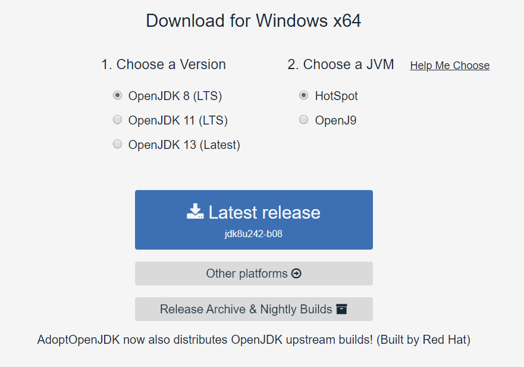

* Next follow the steps to install the package you have downloaded.
  * Windows - [Install page](https://adoptopenjdk.net/installation.html?variant=openjdk11&jvmVariant=hotspot#windows-msi)
  * Mac - [Install page](https://adoptopenjdk.net/installation.html?variant=openjdk11&jvmVariant=hotspot#macos-pkg)

## Install and IDE

The next stage is to install an IDE

### IntelliJ - Recommended

* Visit https://www.jetbrains.com/idea/download/#section=mac for mac or https://www.jetbrains.com/idea/download/#section=windows for windows
* Select the Ultimate or Community Edition and download. Ultimate has a 30 day trial which is nice to use if you have a free trial available. Community Edition is missing a few features from Ultimate but none that matter for this workshop and is completely free
  * Windows - Run the downloaded EXE file
  * Mac - Run the downloaded PKG file
* Configure the SDK
  * Open intelliJ and select File -> Project Structure
  * Notice the **No SDK** which can be seen in the image
  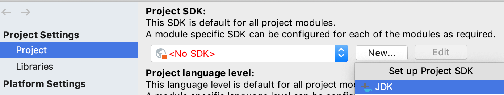
  * Select New -> JDK
  * Navigate to your installed Java SDK
    * Windows - c:\Program Files\AdoptOpenJDK\\***version-downloaded***
    * Mac - /Library/Java/JavaVirtualMachines/***version-downloaded***/Contents/Home

### Eclipse

* Visit https://www.eclipse.org/downloads/packages/
* Find the "Eclipse IDE for Java Developers" and download the version for you operating system
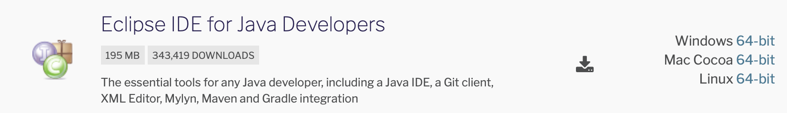
  * Windows - Unzip the downloaded zip folder and run the eclipse.exe file
  * Mac - Open the DMG file and eclipse will install

## Baseline project for the labs

In order to save time during the workshop it would be useful for you to download the baseline project and cache some of dependencies that will be needed for the labs.

### Import starter project

The following URL is pre-configured to take you directly to starter project https://github.com/essentialprogramming/undertow-spring-swagger. Clone or unzip the downloaded archive to a location on your file system.

### Import project into your IDE

#### Clone the project directly from Intellij 
- Select File `->` New `->` Project from Version Control `->` Git. In the URL section insert the link to repository and for the Directory section select a location on your file system.

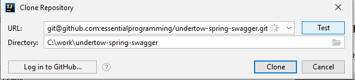

- In the right corner you will receive a notification and select Add as Maven Project

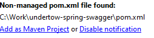

#### Import the project into Intellij by opening the `pom.xml` file .
- Select File `->` Open... and then search for the project file location

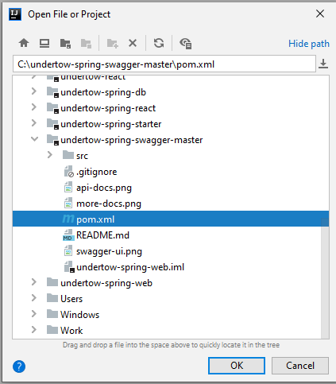

- Select Open as Project and all dependencies will be downloaded automatically

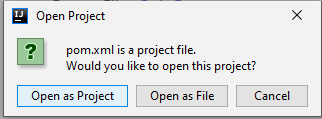

Once this has completed your baseline project is ready. 

### Eclipse

File `->` Import `->` Maven `->` Existing Maven Project.
Follow the wizard to bring in the project and resolve the dependencies.

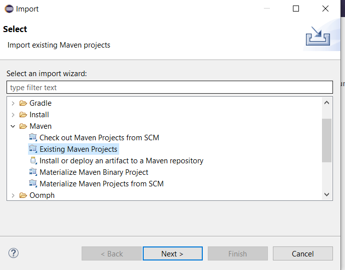

### Verify it works

Now simply run `mvn clean install` from the command line (or terminal in Intellij) to verify that the base project works as expected. 

To run the project go to target directory and run `java -jar uber-undertow-spring-web-1.0.0-SNAPSHOT.jar` from the command line.

## Optional

The following additional installations allow you to complete all the workshop extension tasks. You do not have to install them to complete the core of this workshop.

### A REST client

We will be making requests to the services we build so it is really useful to have a rest client. Please use any of the suggested options:

* In IntelliJ there is one available in Tools `->` HTTP Client `->` Test RESTful Web Service
* For Windows or Mac [POSTman](https://www.getpostman.com/downloads/)
* For chrome [restlet client](https://chrome.google.com/webstore/detail/restlet-client-rest-api-t/aejoelaoggembcahagimdiliamlcdmfm?hl=en)

### GraphQL client
* For Windows [GraphiQL](https://www.electronjs.org/apps/graphiql) or [GraphQL Playground](https://www.electronjs.org/apps/graphql-playground)

### Docker install prerequisites

We next need to install Docker. First it is necessary to create a Docker account.

* To create a Docker account visit the following website and register: https://hub.docker.com/signup

* Next depending on your system you will need to choose the Docker version to install
  
  * Visit [Docker Desktop download page](https://www.docker.com/products/docker-desktop) and choose the Docker version to install (Mac or Windows).

    * Follow the first step to download Docker for your operating system
      * Windows run the EXE file
      * Mac run the DMG file
    * If you wish continue with the rest of the docker guide, however, it is not important
    
* Login into Docker Desktop application using newly created account.

### Docker Deployment prerequisites 

* Go to the previously cloned project pom.xml path and build the project with the following command : ```mvn clean install```
* Create a file and name it ```Dockerfile``` without any exstension.
* Populate the newly created empty file ```Dockerfile``` with the following code :  
``` # Start with a base image containing Java runtime
    FROM openjdk:8-jdk-alpine
    
    
    # Add a volume pointing to /tmp
    VOLUME /tmp
    
    # Make port 8080 available to the world outside this container
    EXPOSE 8080
    
    # The application's jar file
    ARG JAR_FILE=target/uber-undertow-spring-web-1.0.0-SNAPSHOT.jar
    
    # Add the application's jar to the container
    ADD ${JAR_FILE} uber-undertow-spring-web.jar
    
    # Run the jar file
    ENTRYPOINT ["java","-Djava.security.egd=file:/dev/./urandom","-jar","/uber-undertow-spring-web.jar"] 
``` 
* In the same path run the following docker command in order to build the docker image :  
```docker build -t image_name .```
* In the same path run the newly created image with the following command(for testing purposes, locally) :  
```docker run -p 8080:8080 image_name:latest```
* In order to push the docker image to a docker repository, first we have to login : ```docker login```
* After login in, tag the image and push it to docker repository with the following command :  
```docker tag image_name:latest docker_username/image_name:latest```  
```docker push docker_username/image_name:latest```

#### Digital Ocean prerequisites
 ###### This section describes how to set up a fully functioning server on DigitalOcean in less than 20 minutes.
 
 ###### In the following procedure you will connect to your Droplet with SSH, and manually install all required dependencies.
 ###### DigitalOcean is an easy-to-use provider of virtual servers. They offer configurable compute units of various sizes, called Droplets.
* If you haven't already, you need to start by creating an account at Digital Ocean. Follow this [link](https://www.digitalocean.com/?refcode=6a75ff01f865&utm_campaign=Referral_Invite&utm_medium=Referral_Program&utm_source=CopyPaste) and register an account.
* After Sign-In, in order to create a Droplet click Create -> Droplets -> Marketplace -> See all Marketplace Apps -> Search Docker -> Create Docker Droplet. Default configurations of the droplet can be changed if it's required.  
                   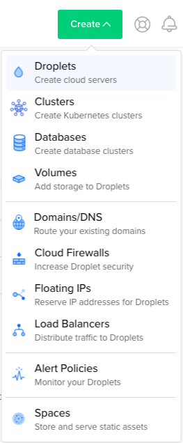 
                   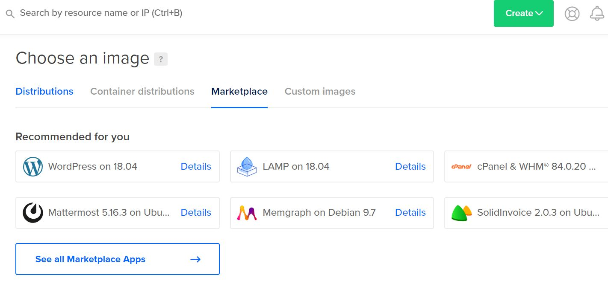 
                   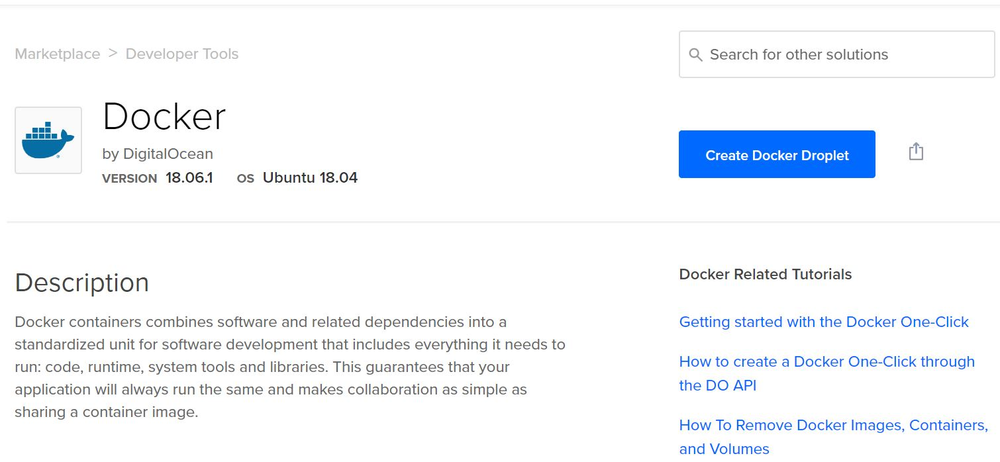
* Create Droplet.
* After the Droplet is created you will receive and email where IP Address,Username and Password is specified.
* Create a ssh connection by executing the following unix command :  
    ```ssh username@IPAddress```  
* You will be asked to provide the password received via e-mail. After that you can change it.              

 ###### If you already create a Droplet with Docker you can skip this step to install Docker on Linux
* After you are connected, create a new shell script file, using the following command :  
 ```vi install-docker.sh```
 and paste the following code : 
  ``` sudo apt-get update  
    sudo apt-get install \
        linux-image-extra-$(uname -r) \
        linux-image-extra-virtual
    sudo apt-get install \
            apt-transport-https \
            ca-certificates \
            curl \
            software-properties-common
    curl -fsSL https://download.docker.com/linux/ubuntu/gpg | sudo apt-key add -
    sudo apt-key fingerprint 0EBFCD88
    sudo add-apt-repository \
       "deb [arch=amd64] https://download.docker.com/linux/ubuntu \
       $(lsb_release -cs) \
       stable"
    sudo apt-get update
    sudo apt-get install docker-ce
    ```
* Give the newly created script execution rights by executing the following unix command :  
```chmod +x install-docker.sh```
* Run the newly created script :  
```sudo ./install-docker.sh```
* Verify the docker installation by running the hello world image :    
 ```sudo docker run hello-world```
 
### Digital Ocean deployment 
* Create a new ssh connection if the old connection to the Digital Ocean Droplet is not opened anymore.  
  ```ssh username@IPAddress```
* In order to pull the docker image from docker repository, first we have to login : ```docker login```
* Pull the image previously pushed into docker repository and run it with the following commands :  
```docker pull docker_username/image_name:latest```  
```docker run -p 8080:8080 docker_username/image_name:latest```
* Test if the the deployment was successful by accessing the following address : http://localhost:8080 in any desired browser.

> Conclusion : Now we have our sample web application dockerized and pushed to a docker repository. Any system with a docker client installed can pull this docker image and run the web application instantly.